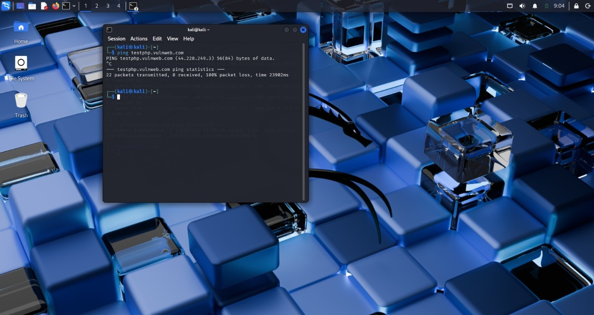
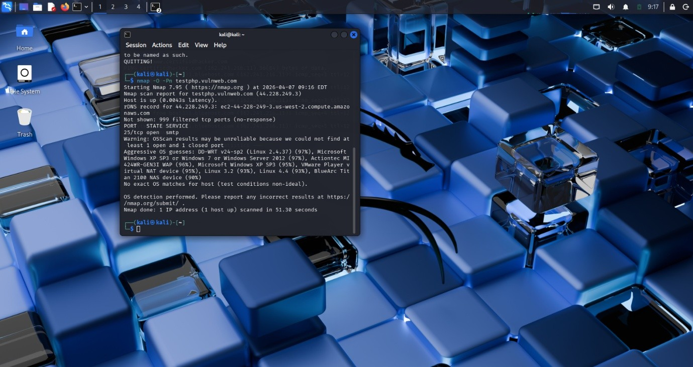

Network Scanning Lab

Objective

To perform network reconnaissance and service discovery in a controlled laboratory environment using Nmap.

Tools Used
* Kali Linux
* Nmap

Activities Performed

Host Discovery
Identified active hosts on the target network using Nmap host discovery techniques.

Port Scanning
Performed TCP port scanning to identify open ports and exposed services.

Service Enumeration
Enumerated service versions and gathered information about running services.

Operating System Detection
Performed operating system fingerprinting to identify the target operating system.

Results
* Successfully identified active hosts.
* Discovered open ports and exposed services.
* Enumerated service information and versions.
* Gathered information useful for vulnerability assessment.

## Skills Demonstrated

* Network Reconnaissance
* Host Discovery
* Port Scanning
* Service Enumeration
* Operating System Fingerprinting
* Security Assessment

## Screenshots

### Host Discovery

### Port Scanning

### Service Enumeration

### Operating System Detection

### Scan Results

## Disclaimer

This project was conducted in a controlled laboratory environment for educational and ethical cybersecurity training purposes only.

